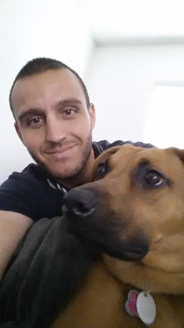

# Ray Wenderlich Android Bootcamp - Summer of 2020

## Profile

* **Name**: Matthew Spire
* **Discord Username**: HealerQween
* **Location**: California and Maine, USA

As far as programming experience goes, I have dabbled in a number of different programming languages, from Assembly (x86) 
to Python. I know a little about a lot, which means to say that I still have a lot to learn.  I do have a foundation to 
build off of. I am excited to learn more about Kotlin and Android development.

When it comes to goals, I hope to learn Kotlin and Android so that I can build a web app and a mobile app that utilize 
the same API. Hopefully my idea for a web app will take off and I will be able to support myself and my family.  

As for hobbies, I like to walk my dogs, run, play video games, and golf. Watching movies and getting lost on YouTube is 
how I unwind.